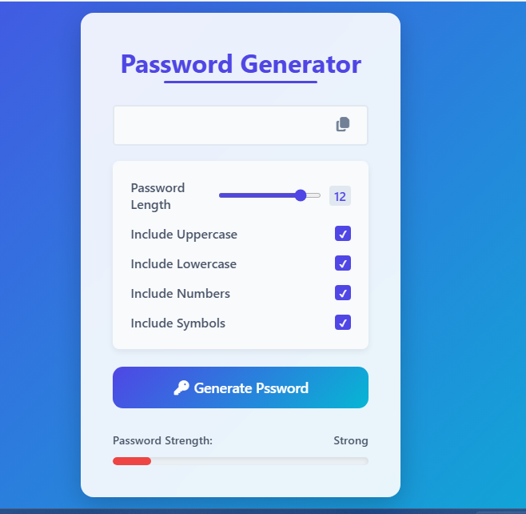

# 🔐 Password Generator

A simple and responsive password generator built with **HTML, CSS, and JavaScript**.

---

🌐 Live Demo

👉 https://habibtamkinfx.github.io/password-generator/

---

## 🚀 Features

- Generate random passwords
- Customize password length
- Include:
  - Uppercase letters
  - Lowercase letters
  - Numbers
  - Symbols

- Password strength meter (Weak / Medium / Strong)
- Copy password to clipboard with visual feedback

---

## 🧠 What I Learned

- Working with JavaScript logic
- Handling DOM manipulation
- Using event listeners
- Building a password strength system
- Using Clipboard API
- Improving UI with dynamic feedback

---

## 🛠️ Technologies Used

- HTML5
- CSS3 (Glass UI style)
- JavaScript (Vanilla JS)
- Font Awesome

---

## 📸 Preview

---

## 📂 How to Use

1. Clone the repository:
   git clone https://github.com/habibtamkinfx/password-generator.git

2. Open `index.html` in your browser

---

## 🎯 Future Improvements

- Better password validation
- Toast notifications instead of alerts
- Stronger password generation logic
- Mobile UI improvements

---

## 🙋‍♂️ About Me

Frontend Developer in progress, learning JavaScript and React, building simple and responsive web projects.

---

## ⭐ Support

If you like this project, consider giving it a star ⭐
